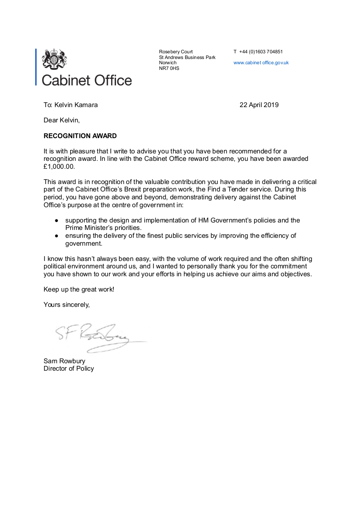

  

# kelvinkamara.com

(2020) Award-Winning Web Developer.

Mr. Kelvin Kamara has over ten years of commercial experience delivering both front-end and back-end solutions. He believes in using the right tool for the job and takes a practical, quality-driven approach to building effective software.

With a particular strength in back-end and server-side development, Kel received the UK Government Cabinet Office Recognition Award in April 2019 for his work on secure web systems.

* [Requirements](#requirements)

* [Installation](#installation)

* [Usage](#usage)

* [Using Docker?](#using-docker)

    * [Existing Admin User When Using Docker](#existing-admin-user-when-using-docker)

    * [Using Docker's Mail Server](#using-dockers-mail-server)

* [iPython Django Shell](#ipython-django-shell)

* [API](#api)

* [Cache View Templates](#cache-view-templates)

* [Extra Details](#extra-details)

* [Contributing](#contributing)

* [License](#license)

## Requirements

* [Tested using Python 3.13](https://www.python.org)

## Installation

```bash
cp .env.example .env

pip install virtualenv && \
  virtualenv env && \
  source env/bin/activate

python manage.py makemigrations
python manage.py migrate
```

## Usage

```bash
python manage.py runserver
# http://localhost:8000
```

## Using Docker?

```bash
alias compose='docker-compose -f local.yml'
compose build
compose up
# http://localhost:8000
```

#### Existing Admin User When Using Docker

The admin user details are set in [./compose/local/django/start](./compose/local/django/start) .

```bash
export DJANGO_SUPERUSER_PASSWORD="${DJANGO_SUPERUSER_PASSWORD:-secret}"

python manage.py createsuperuser \
  --username admin_user \
  --email admin@django-app.com \
  --no-input \
  --first_name Admin \
  --last_name User
```

#### Using Docker's Mail Server


Mail environment credentials are at [.env](./.env.example) .

The [Mailhog](https://github.com/mailhog/MailHog) Docker mail client runs at `http://localhost:8025`. This is running in the above image that is receiving emails from your Django app.

## iPython Django Shell

```bash
python manage.py shell -i ipython
```

## API

```bash
python manage.py show_urls
```

## Cache View Templates

```bash
python manage.py collectstatic
```

## Extra Details

This website uses an older version of the premium website theme, [Writter](https://themeforest.net/item/writter-minimal-membership-subscription-ghost-theme/35463290?srsltid=AfmBOoqjqZ4qwuzO1v5SrwAStq4XaNxurwmS6KA9bfGcWLJssXkbHvum).

The recommendations section uses the reviews slider at https://codepen.io/legwork/pen/PKaVpE .

## Contributing
Pull requests are welcome. For major changes, please open an issue first to discuss what you would like to change.

Please make sure to update tests as appropriate.

## License
All rights reserved. This is a proprietary portfolio project.

No permission is granted to copy, modify, redistribute, or create derivative
works without prior written consent.

Relicensing notice: this repository is proprietary from 22 June 2026 onward.
Versions published before that date were made available under BSD-3-Clause.

See [license](./license) for current terms, [LICENSING.md](./LICENSING.md) for
relicensing and contributor ownership notes, and
[THIRD_PARTY_NOTICES.md](./THIRD_PARTY_NOTICES.md) for third-party licensing
boundaries.
